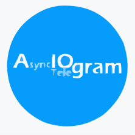

<link rel="stylesheet" href="devicon.min.css">

<h1 align="center"> Hi there, I'm <a href="https://github.com/Mksm3000/" 
target="_blank">Maksim</a> 
</h1>

<h2 align="center"> I'm a student of the School of Test Automation Engineers <a 
href="https://qa.guru/" target="_blank">QA.GURU</a></h2>
<h2 align="center">  </h2>

<h3> On this page you will find my projects and tutorials related to test 
automation.</h3>

<h2> Languages and Tools...</h2>

<h2> Github Stats </h2>

<h2> Socials and Contacts </h2>

 
 

